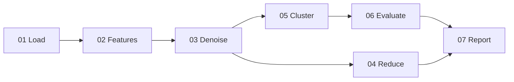
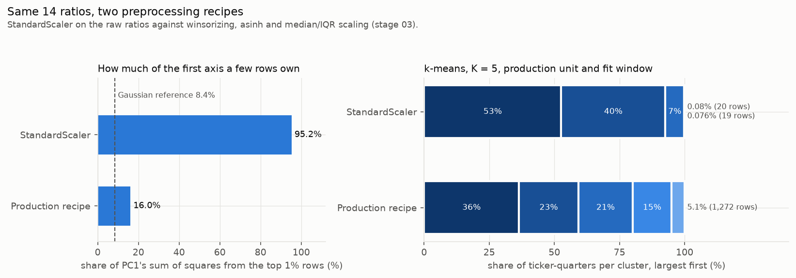
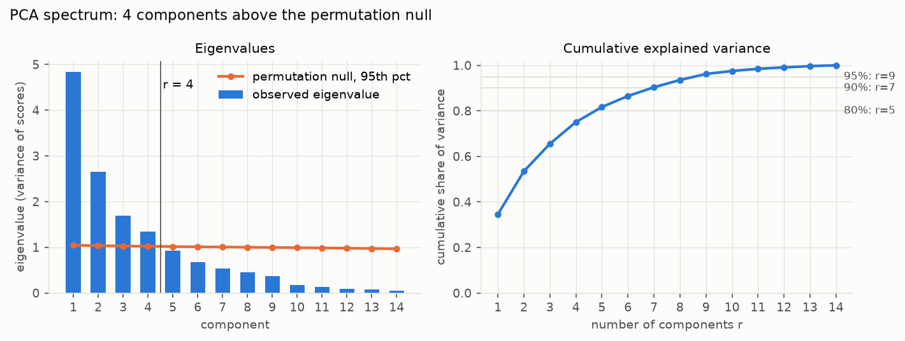
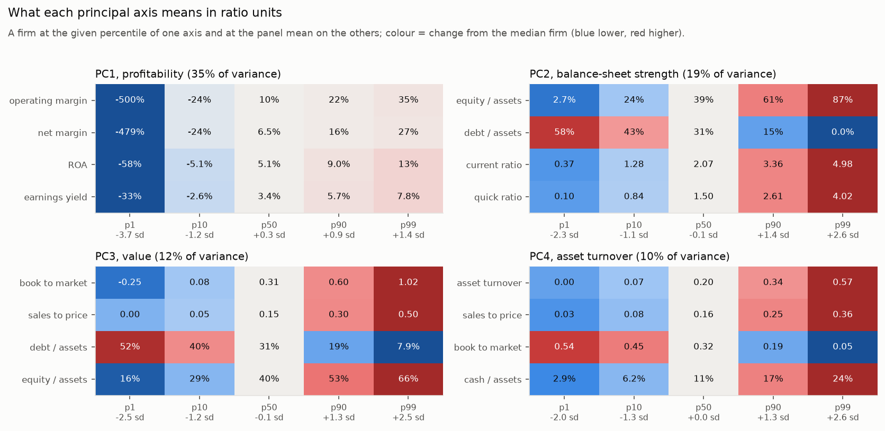
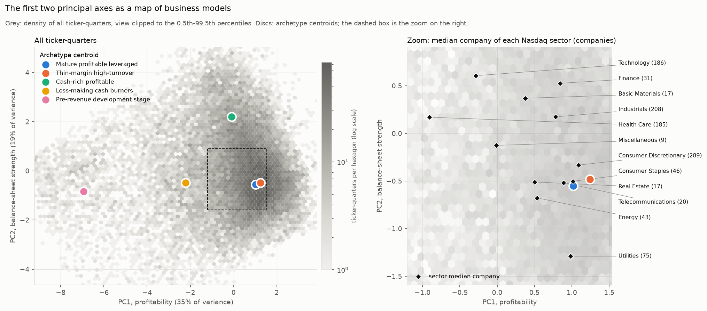
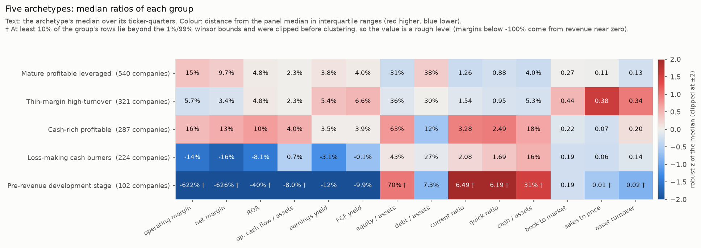
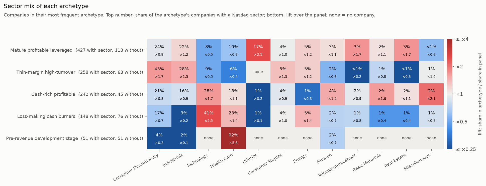
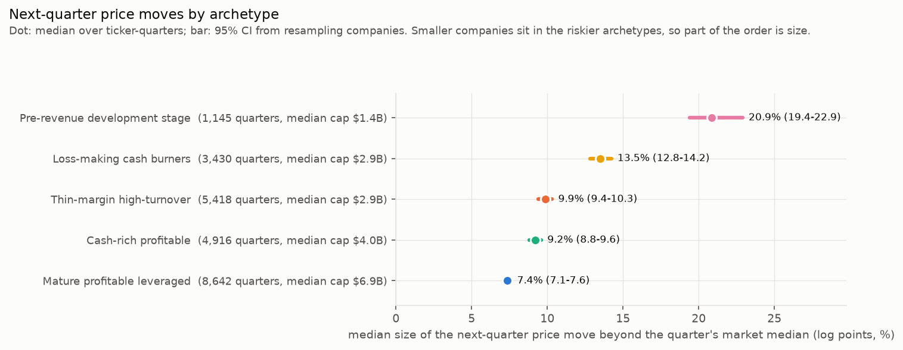
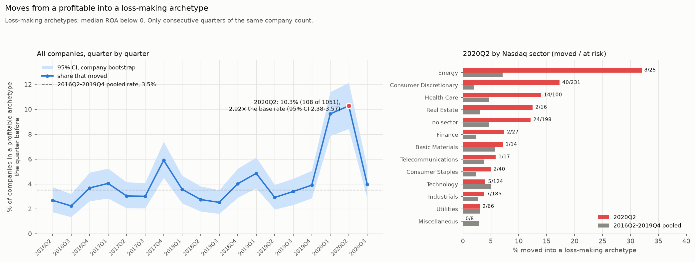
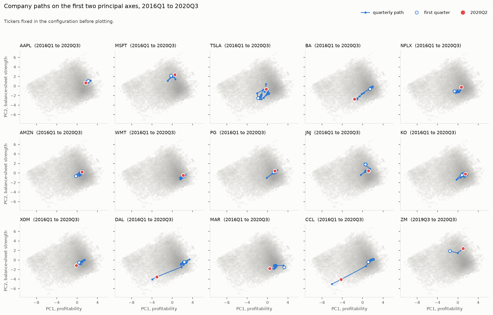

# Fundamental clustering of US companies

> This repository is a demo version of a private project. It holds the write-up, the figures and part of the code. The core stages (denoising, dimensionality reduction, clustering and evaluation), the studies and the regression tests stay private, so the pipeline does not run from here. [Code availability](#code-availability) lists what is included.

This project sorts US-listed non-financial companies into five business-model archetypes using 14 accounting ratios. The data are SHARADAR quarterly fundamentals for 2016Q1 to 2020Q3: 25,130 company-quarters of 1,474 companies. The archetypes come back when the model is refit on companies it has not seen (stability 0.936, against 0.330 to 0.412 for a UMAP + DBSCAN baseline). They also anticipate the size of a company's next-quarter price move beyond its sector, quarter and size. The methods are inspired by the [UIUC CS441 Applied Machine Learning (Fall 2025)](https://courses.grainger.illinois.edu/cs441/fa2025/) lectures on denoising, dimensionality reduction and clustering.

## Contents

- [How a clustering is judged](#how-a-clustering-is-judged)
- [Pipeline](#pipeline)
- [Results](#results)
  - [Compressing the tails decides most of the outcome](#compressing-the-tails-decides-most-of-the-outcome)
  - [Four axes describe the ratios](#four-axes-describe-the-ratios)
  - [Five archetypes reproduce on unseen companies](#five-archetypes-reproduce-on-unseen-companies)
  - [The archetype works as a cheap risk label](#the-archetype-works-as-a-cheap-risk-label)
  - [The 2020 shock moved companies across archetypes](#the-2020-shock-moved-companies-across-archetypes)
- [Baseline comparison](#baseline-comparison)
- [Repository layout](#repository-layout)
- [Appendix](#appendix)
  - [Glossary](#glossary)
  - [Challenges](#challenges)
  - [Limitations](#limitations)
  - [Code availability](#code-availability)
  - [Data source](#data-source)

Technical terms are defined in the [Glossary](#glossary).

## How a clustering is judged

A company reports about 19 quarters that look almost the same, so the 25,130 rows carry roughly as much information as 1,900 independent ones. Row-level tests ignore this and called random company labels significant 49% to 95% of the time. Every test, resample and permutation here therefore treats one company as one unit.

A clustering then has to pass two layers:

1. It must reproduce on unseen companies. Stability, the mean adjusted Rand index (ARI, 1 for identical partitions) of refits on 80% of the companies, must reach 0.6. Size-weighted prediction strength must reach 0.8 and agreement across seeds 0.9, with at most 20% noise and no cluster above 60% of the rows.
2. Clusterings that pass are ranked by information they were not built from: how well they separate the size of next-quarter price moves beyond a within-sector permutation null.

## Pipeline



| Stage | What it does |
| --- | --- |
| `01_load_data` | Reads the extract and drops rows with a missing value. Banks, insurers and most REITs report no current assets or liabilities and drop out, so the results cover non-financial companies. |
| `02_features` | Builds 14 scale-free ratios (valuation yields, margins, ROA, liquidity, leverage, asset turnover and cash flow) and data-quality flags that stay out of the clustering. |
| `03_denoise` | Winsorizes at 1% and 99%, scales by median and IQR, takes asinh, and flags outliers by a vote of three detectors while keeping them. |
| `04_reduce` | Runs a correlation PCA whose number of components comes from parallel analysis, plus UMAP and t-SNE maps for viewing. |
| `05_cluster` | Fits k-means with K = 5 on each company's median profile over 2016 to 2019 and labels every quarter by its nearest centroid. |
| `06_evaluate` | Applies the two-layer rule with company-grouped refits, 5 seeds and 200 permutations. |
| `07_report` | Names the axes and archetypes by fixed rules and draws the figures below. |

Settings are in `configs/default.yaml`.

## Results

The numbers below come from the production run, the baseline runs and four closed studies archived in the private repository. A separate verification pass with its own code and seeds reproduced each one.

### Compressing the tails decides most of the outcome

Under plain z-scores the top 1% of rows hold 80% of the variance of the baseline's 12 ratios, against 3% for a Gaussian with the same covariance, so a few near-zero-revenue biotechs set the distances. After winsorizing and asinh, every clusterer tested finds balanced groups that track sector and risk better. Volatility separation (epsilon squared, the share of rank variation explained by the clusters) rises from 0.164 to 0.282, and the largest cluster shrinks from 59% to 34% of the rows.



The same 14 ratios under StandardScaler and under the production recipe.

### Four axes describe the ratios

Parallel analysis keeps four principal components: profitability, balance-sheet strength, value and asset turnover. They explain 75.1% of the variance (74.5% to 74.7% on companies left out of the fit) and keep their meaning in every year from 2016 to 2019. Sectors separate on all four (epsilon squared 0.053 to 0.186, null 0.009). The axes serve maps and interpretation. Clustering stays on the 14 ratios, which separate next-quarter moves better than k-means on the axis scores (0.222 against 0.190).



Eigenvalues against the 95th percentile of a column-permutation null; four components stand above it.



Each axis in ratio units for a company at the 1st, 10th, 50th, 90th and 99th percentile of that axis.



All company-quarters on the first two axes, with the archetype centroids and each sector's median company.

### Five archetypes reproduce on unseen companies

The data have no natural number of clusters (the gap statistic picks K = 2), so reproducibility sets K. Size-weighted prediction strength is 0.89, 0.87 and 0.77 at K = 4, 5 and 6, and K = 4 puts 55% of the rows in one cluster. Of 151 candidates (k-means, bisecting k-means, Ward, Gaussian mixtures, DBSCAN and HDBSCAN), only k-means with K = 5 on company profiles passes both layers in every seed.

| Archetype | Companies | Examples | Operating margin | Cash / assets | Debt / assets | Median next-quarter move |
| --- | --- | --- | --- | --- | --- | --- |
| Mature profitable leveraged | 540 | AAPL, JNJ, XOM, KO | 15% | 4.0% | 38% | 7.4% |
| Thin-margin high-turnover | 321 | WMT, COST, F, DAL | 5.7% | 5.3% | 30% | 9.9% |
| Cash-rich profitable | 287 | MSFT, GOOGL, NVDA | 16% | 18% | 12% | 9.2% |
| Loss-making cash burners | 224 | TSLA, UBER, SNAP | -14% | 16% | 27% | 13.5% |
| Pre-revenue development stage | 102 | MRNA, NKLA | -622% (†) | 31% (†) | 7.3% | 20.9% |

Values are archetype medians. The move is the median of the absolute next-quarter log price change minus that quarter's cross-sectional median. (†) At least 10% of these rows were clipped by the winsor bounds, so the median is a rough level.



Median ratios of each archetype, coloured by distance from the panel median in interquartile ranges.



Sector mix of each archetype and its lift over the panel.

### The archetype works as a cheap risk label

The median next-quarter move grows from 7.4% for mature leveraged companies to 20.9% for pre-revenue ones. With sector, quarter and size-decile fixed effects the archetype still adds 2.8% of explained variance, and 2.9% when fitted on 2016 to 2017 and tested from 2018. The result concerns the size of the move only; its direction and any trading strategy were not tested.



Median size of the next-quarter move beyond the quarter's market median, with 95% intervals from resampling companies.

### The 2020 shock moved companies across archetypes

In 2020Q2, 10.3% of the companies in a profitable archetype moved into a loss-making one, against 3.5% in an average quarter of 2016 to 2019 (2.9 times, 95% interval 2.4 to 3.6). Consumer discretionary, health care and energy companies moved most. Cruise lines, casinos and Delta landed beside pre-revenue biotechs because their sales nearly vanished.



Share of profitable companies moving into a loss-making archetype by quarter, and 2020Q2 by sector.



Quarterly paths of the 15 companies fixed in the configuration, 2020Q2 in red.

## Baseline comparison

The baseline embeds 12 standardized ratios in two dimensions with UMAP and clusters the plane with DBSCAN. Its re-implementation uses the same panel and evaluation code.

| Score | k-means K = 5 | UMAP + DBSCAN (3 seeds) | Requirement |
| --- | --- | --- | --- |
| Clusters | 5 | 17 to 20 | |
| Stability (ARI of refits on 80% of companies) | 0.936 | 0.330 to 0.412 | at least 0.6 |
| Prediction strength, size-weighted | 0.850 | 0.375 to 0.395 | at least 0.8 |
| Seed agreement (ARI across 5 seeds) | 0.991 | 0.685 to 0.788 | at least 0.9 |
| Noise share | 0.000 | 0.118 to 0.127 | at most 0.2 |
| Separation of next-quarter moves beyond sector | 0.222 | 0.178 to 0.182 | higher is better |

The baseline's clusters carry information beyond sector, yet they do not come back on other companies. Part of the loss comes from the standardization, whose mean and standard deviation shift whenever a subsample gains or loses a few extreme companies.

## Repository layout

The full project is organised by pipeline stage. Each stage folder under `src/` holds `code/` for the algorithms, `utils/` for its command-line entry point and a README naming its inputs and outputs, and `scripts/` mirrors the same stage numbers.

This demo keeps the same layout. Parts marked (private) are empty or absent here, and the README figures sit in `figures/` instead of `outputs/bank/`; [Code availability](#code-availability) has the details.

```text
fundamental-clustering/
├── README.md
├── pyproject.toml                           pytest settings; the project is not packaged
├── configs/
│   └── default.yaml                         production configuration
├── environment_installation/                requirements, installer, environment check, local.env template
├── src/                                     one folder per pipeline stage
│   ├── 00_shared/                           configuration, I/O, logging, run directories, plotting
│   ├── 01_load_data/                        read the extract, apply the missing-data policy
│   ├── 02_features/                         14 ratios and data-quality flags
│   ├── 03_denoise/                          winsorize, asinh, outlier vote (private)
│   ├── 04_reduce/                           PCA with parallel analysis, UMAP and t-SNE maps (private)
│   ├── 05_cluster/                          k-means on company profiles (private)
│   ├── 06_evaluate/                         the two-layer selection rule (private)
│   ├── 07_report/                           names, figures and the run summary
│   ├── 08_review/                           regression tests (private)
│   └── fundclust/                           import layer for the digit-named stage folders
├── scripts/
│   ├── 01_load_data/ … 07_report/           one PowerShell launcher per stage
│   ├── _common.ps1                          shared launcher setup
│   └── run_pipeline.ps1                     runs every stage in order
├── baselines/                               (private)
│   └── umap_dbscan/                         the UMAP + DBSCAN comparison method (private)
├── outputs/                                 (private)
│   ├── bank/                                the latest verified production run, with the README figures (private)
│   └── archive/                             earlier runs and audit records, kept local (private)
└── docs/
    └── challenges.md                        problems met and how they were solved
```

## Appendix

### Glossary

| Term | Plain meaning | Source |
| --- | --- | --- |
| ADR | American depositary receipt: a US-listed share of a foreign company. Some report their accounts in home currency against a dollar price. | Finance usage |
| Archetype | A group of companies with a similar business model, found by the clustering. | This project |
| ARI (adjusted Rand index) | Agreement between two partitions of the same items, corrected for chance: 1 for identical partitions, about 0 for unrelated ones. | Hubert & Arabie (1985) |
| asinh | The inverse hyperbolic sine, ln(x + √(x² + 1)). It is close to linear near zero and logarithmic in the tails, and unlike log it accepts negative values. | Burbidge, Magee & Robb (1988) |
| Company profile | A company's median of each denoised ratio over 2016 to 2019. k-means is fitted on these, one per company. | This project |
| Company-quarter | One company's ratios for one fiscal quarter, which is one row of the data. | This project |
| DBSCAN | Density-based clustering: points in dense regions form clusters and isolated points are labelled noise. | Ester et al. (1996) |
| Epsilon squared (ε²) | The effect size of a Kruskal-Wallis test: the share of the variation in ranks that the groups explain, from 0 to 1. | Tomczak & Tomczak (2014) |
| Gap statistic | A rule that picks the number of clusters K where the within-cluster spread falls furthest below that of reference data with no clusters. | Tibshirani, Walther & Hastie (2001) |
| IQR (interquartile range) | The distance between the 25th and 75th percentiles. Scaling by median and IQR centres a ratio without being pulled by outliers. | Descriptive statistics |
| k-means | Assigns each point to the nearest of K centres, moves each centre to the mean of its points, and repeats until nothing changes. | [CS441](https://courses.grainger.illinois.edu/cs441/fa2025/) Lecture 4 |
| Next-quarter move | The absolute value of a company's log price change over the next quarter minus that quarter's median change across companies, so a market-wide crash adds nothing. | This project |
| Noise share | The share of rows a density method such as DBSCAN leaves out of every cluster. | Ester et al. (1996) |
| Outlier vote | A row is flagged when at least two of three detectors (Gaussian-mixture likelihood, PCA reconstruction error and distance to the 15 nearest neighbours) put it in their top 1%. Flagged rows are kept. | [CS441](https://courses.grainger.illinois.edu/cs441/fa2025/) Lecture 11 |
| Parallel analysis | Keeps the principal components whose variance exceeds the 95th percentile of what the same data give after each column is shuffled independently. | Horn (1965) |
| Partial R² | The share of the variation in next-quarter moves that the archetype explains after sector, quarter and size-decile dummies (fixed effects) are already in the regression. | Regression analysis |
| PCA (principal component analysis) | Rotates the ratios into uncorrelated axes ordered by how much variance each explains. Here it runs on the correlation matrix. | [CS441](https://courses.grainger.illinois.edu/cs441/fa2025/) Lecture 5 |
| Permutation null | The scores obtained after shuffling cluster labels among whole companies, 200 times. A real result has to beat it. The within-sector version shuffles only among companies of the same sector, so beating it means information beyond sector. | This project |
| Persistence | Agreement (Cohen's kappa) between a company's cluster in one quarter and in the next. | Cohen (1960) |
| Prediction strength | Split the companies into two halves and cluster each. For each cluster in one half, take the share of its pairs of points that the other half's model also puts together. The paper keeps the weakest cluster; the rule here uses the mean weighted by cluster size. | Tibshirani & Walther (2005) |
| Scale-free ratio | A ratio of two accounting values, such as debt over assets, in which company size cancels out. | This project |
| Seed agreement | The mean ARI between fits on the full data that differ only in the random seed. | This project |
| Separation beyond sector | The mean of the ε² of next-quarter move size and of volatility across clusters, each measured above the within-sector permutation null. Higher means the clusters say more about risk than sector does. | This project |
| Silhouette | For each point, how much closer it is to its own cluster than to the nearest other one, from -1 to 1, averaged over points. | Rousseeuw (1987) |
| Stability | The mean ARI between pairs of clusterings refitted on random 80% subsets of the companies, compared on the rows they share, over 10 refits. | This project |
| StandardScaler | Subtracts each ratio's mean and divides by its standard deviation, giving z-scores. The baseline uses it. | scikit-learn |
| t-SNE | A nonlinear method that places similar points close together in a 2-D map, used here for viewing only. | van der Maaten & Hinton (2008) |
| UMAP | A nonlinear method that places similar points close together in a low-dimensional map. The baseline clusters its 2-D map. | McInnes, Healy & Melville (2018) |
| Volatility | The standard deviation of a company's market-adjusted quarterly price change over its quarters in one cluster. | This project |
| Winsorize | Clip each ratio at its 1st and 99th percentiles so a few extreme values cannot set the distances. | [CS441](https://courses.grainger.illinois.edu/cs441/fa2025/) Lecture 11 |

### Challenges

Eight problems shaped the method. [docs/challenges.md](docs/challenges.md) gives the evidence and the fix for each.

- [A few rows owned the variance](docs/challenges.md#a-few-rows-owned-the-variance): taking asinh after median/IQR scaling cut the top 1% of rows' share of the variance to about 10%.
- [Repeated quarters of the same company](docs/challenges.md#repeated-quarters-of-the-same-company): every test and resample uses one unit per company.
- [Good scores that measured something else](docs/challenges.md#good-scores-that-measured-something-else): silhouette and persistence rewarded degenerate clusterings, so selection uses the two-layer rule.
- [No natural number of clusters](docs/challenges.md#no-natural-number-of-clusters): K is set by reproducibility on unseen companies.
- [UMAP islands that persistence alone produces](docs/challenges.md#umap-islands-that-persistence-alone-produces): a null that keeps each company's series and breaks how its ratios pair up still gives 11 to 17 islands.
- [Data problems the filters hid](docs/challenges.md#data-problems-the-filters-hid): rules flag home-currency ADRs, share-count errors and revenue collapses.
- [Seeded UMAP that changed with the thread count](docs/challenges.md#seeded-umap-that-changed-with-the-thread-count): UMAP runs on one thread, and a regression test checks bitwise equality.
- [Keeping the return check honest](docs/challenges.md#keeping-the-return-check-honest): moves are measured against the quarter's market median, repeated on the post-filing window and controlled for size.

### Limitations

- Financial firms are excluded by the missing-data filter.
- Prices are split-adjusted without dividends, and delisted companies, more often loss-making, drop out of the forward returns, so the risk gaps are probably understated.
- Sector labels are current listings: 348 companies have none, and a reused ticker can carry another company's sector.
- The 2016 to 2019 fit window and the selection thresholds were chosen on this dataset; K = 5 holds for prediction-strength thresholds from 0.75 to 0.85.

### Code availability

| Part | Public here |
| --- | --- |
| `src/00_shared`, `src/01_load_data`, `src/02_features`, `src/07_report`, `src/fundclust` | Yes |
| `scripts/`, `configs/`, `environment_installation/`, `pyproject.toml` | Yes |
| `docs/challenges.md` and the nine figures in `figures/` | Yes |
| `src/03_denoise`, `src/04_reduce`, `src/05_cluster`, `src/06_evaluate` (the core methods) | No |
| `src/08_review` (regression tests), `baselines/umap_dbscan/` | No |

The private stages appear as empty folders under `src/`, so the layout matches the full project. The public stages import the private ones, so this code shows the structure of the pipeline without running on its own. The figures were drawn by `src/07_report` in the production run. The full code is available on request.

### Data source

The quarterly fundamentals extract (`fund.csv`) and the SHARADAR indicator definitions come from the public repository [Jasone818/clustering-the-stock-market](https://github.com/Jasone818/clustering-the-stock-market), which clustered stocks with UMAP and DBSCAN; that method is this project's baseline. The figures are SHARADAR Core US Fundamentals from Nasdaq Data Link, whose terms of use govern redistribution, so the data stay outside this repository.
